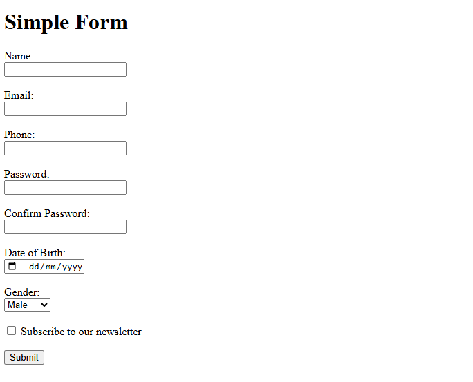

# Simple Form Project 📝

This project contains a simple HTML form with 5 input fields.

## Project Structure 📁

- `index.html`: The file where you will write your code.

## Your Task ✨

Your goal is to create the `index.html` file with a form that includes the following fields:

1.  Name
2.  Email
3.  Phone
4.  Password
5.  Confirm Password
6.  Date of Birth (date input)
7.  Gender (select dropdown)
8.  A checkbox for "Subscribe to newsletter"

Good luck! 🚀

## Goal

The project should look like this:

