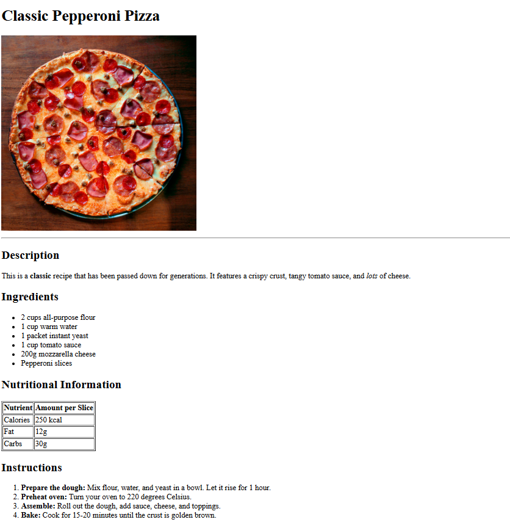

# 🍳 The Ultimate Recipe 🍳

Welcome to "The Ultimate Recipe" project! This is a fun exercise to practice your HTML skills.

## 📝 Instructions

Your goal is to create a recipe page using HTML. Here are some basic steps to guide you:

1.  **Structure your HTML:** Start with a basic HTML5 boilerplate.
2.  **Add a Title:** Give your recipe a catchy title.
3.  **Include an Image:** Every good recipe needs a mouth-watering picture.
4.  **List the Ingredients:** Use a list for the ingredients.
5.  **Write the Steps:** Use an ordered list for the preparation steps.
6.  **Add some style (optional):** If you know some CSS, try to make your recipe page look more appealing!

## 🎯 Goal

Your final recipe page should look something like this:



## 🔖 HTML Tags Reference

Here are some common HTML tags you might find useful for this project:

*   `<h1>`, `<h2>`, `<h3>`, `<h4>`, `<h5>`, `<h6>`: **Headings**. Use these to structure the sections of your recipe (e.g., "Ingredients", "Instructions"). `<h1>` is the most important, and `<h6>` is the least.
*   `<p>`: **Paragraph**. Use this for any block of text.
*   ``: **Image**. Used to display an image. Remember the `src` attribute for the image path and the `alt` attribute for accessibility.
*   `<a>`: **Anchor/Link**. Use this to link to other pages or resources.
*   `<ul>`: **Unordered List**. Great for listing ingredients where the order doesn't matter. List items are created with the `<li>` tag.
*   `<ol>`: **Ordered List**. Perfect for step-by-step instructions. List items are also created with the `<li>` tag.
*   `<table>`: **Table**. You can use a table to display nutritional information or other structured data. Tables are built with `<tr>` (table row), `<th>` (table header), and `<td>` (table data/cell) tags.

**Example of a simple table:**
```html
<table>
  <tr>
    <th>Nutrient</th>
    <th>Amount</th>
  </tr>
  <tr>
    <td>Calories</td>
    <td>300</td>
  </tr>
  <tr>
    <td>Protein</td>
    <td>20g</td>
  </tr>
</table>
```

Good luck and have fun coding! 🚀
